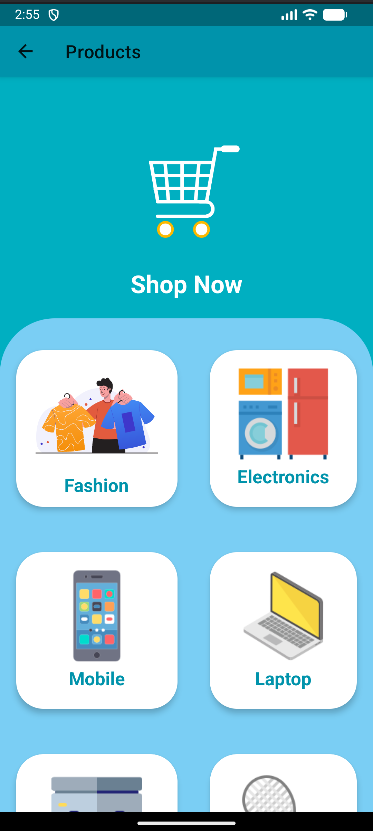

# 🛒 Smart Shop App

An Android-based shopping application built using Java.
This app allows users to browse products, view details, and simulate an e-commerce experience.

---

## 🚀 Features

* 🛍️ Browse products
* 🔍 View product details
* 🛒 Add to cart functionality
* 📱 Clean and user-friendly UI

---

## 📥 Download App

👉 [Download APK](https://github.com/vishwa214/smart-shop-app/releases/download/v1.0/app-release.apk)

---

## 🛠️ Tech Stack

* Java
* Android Studio
* XML (UI Design)

---

## 📸 Screenshots

(Add your app screenshots here)

---

## 👨‍💻 Developer

Vishwanth

---

## ⭐ Support

If you like this project, give it a ⭐ on GitHub!
## 📸 Screenshots

### 🏠 Home Screen
![Home]Screenshot 2026-04-25 145640.png)

### 📦 Product Screen

### 🛒 Cart Screen

