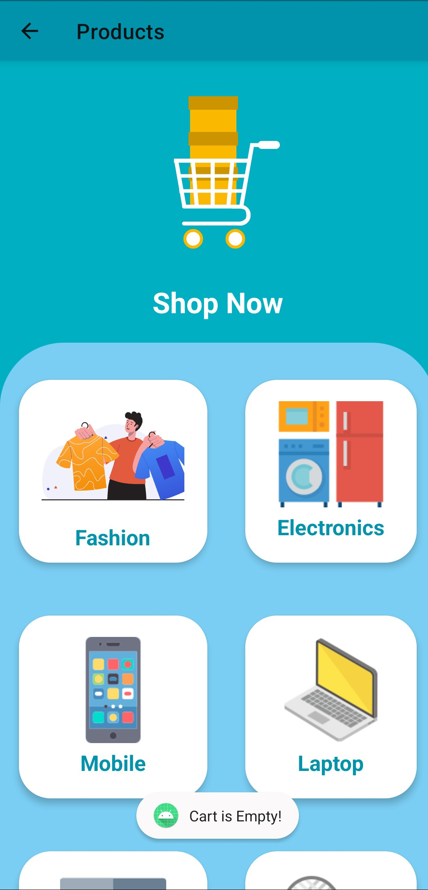
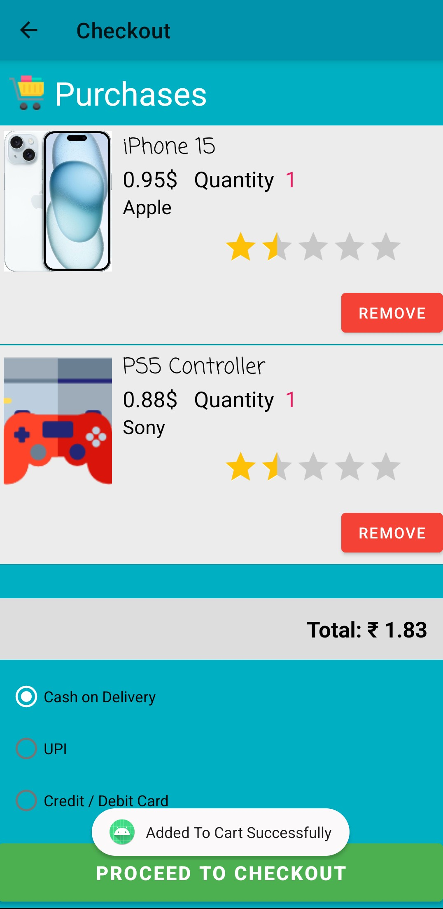

# 🛒 Smart Shop App

An Android Shopping Application built using <b>Java</b> that provides a simple and intuitive shopping experience with a clean user interface.

---

# 📖 About

Smart Shop App is an Android-based shopping application developed using **Java** and **Android Studio**.

The application provides a smooth shopping experience where users can browse products, view product details, manage their shopping cart, and enjoy a clean and responsive user interface.

---

# ✨ Features

- 🛍️ Browse products
- 📦 Product categories
- 🔍 View detailed product information
- 🛒 Add products to cart
- ❤️ Simple and attractive UI
- ⚡ Fast navigation
- 📱 Android Material Design
- 🔄 Responsive layouts

---

# 📥 Download APK

📲 Download the latest APK from GitHub Releases.

👉 **Download Here**

https://github.com/vishwa214/smart-shop-app/releases/download/v1.0/app-release.apk

---

# 📱 Screenshots

> Add screenshots inside a folder named **screenshots**

screenshots/
│
├── home.png
├── products.png
├── product_details.png
├── cart.png
└── profile.png

Example:

markdown
## Home Screen

## Products

## Cart

---

# 🛠️ Tech Stack

### Language

- Java

### IDE

- Android Studio

### UI

- XML

### Database

- SQLite

### Version Control

- Git
- GitHub

---

# 📂 Project Structure

app/
│
├── java/
│
├── res/
│   ├── drawable/
│   ├── layout/
│   ├── mipmap/
│   └── values/
│
├── AndroidManifest.xml
│
└── build.gradle

---

# 🚀 Getting Started

## Clone Repository

bash
git clone https://github.com/vishwa214/smart-shop-app.git

## Open Project

Open the project in **Android Studio**

## Build Project

Sync Gradle and Run the application.

---

# 🎯 Future Improvements

- 💳 Online Payment Integration
- ❤️ Wishlist
- 🔐 User Authentication
- ☁ Firebase Backend
- 📦 Order History
- 🔔 Push Notifications
- 🌙 Dark Mode
- ⭐ Product Ratings & Reviews

---

# 👨‍💻 Developer

## Vishwanth

Android Developer • Full Stack Developer • AI & Computer Vision Enthusiast

GitHub

https://github.com/vishwa214

---

# ⭐ Support

If you found this project helpful,

⭐ **Please consider giving it a Star on GitHub!**

It motivates me to build more useful projects.

---

# 📄 License

This project is licensed under the **MIT License**.

---

Made with ❤️ by <b>Vishwanth</b>

